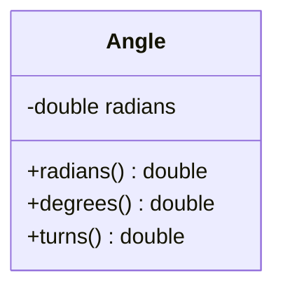

# Angle class

## Diagram



## Summary

Language        | Type      | Symbol
:---------------| :-------- | :-------------------------------------------------
[C]             | struct    | `Angle`
[C++]           | struct    | `dogma::Angle`
[Dart]          | class     | `Angle`
[Protobuf]      | message   | `dogma.Angle`
[Python]        | class     | `dogma.Angle`
[Ruby]          | class     | `Dogma::Angle`
[Rust]          | struct    | `dogma::Angle`
[Zig]           | struct    | `dogma.Angle`

## Description

Angles are represented using [radians], but can be constructed from radians,
[degrees], or [turns].

## Constants

## Constructor

### From degrees

=== "C"

    ```c
    AngleFromDegrees(180)
    ```

=== "C++"

    ```c++
    Angle::from_degrees(180)
    ```

=== "Dart"

    ```dart
    Angle.fromDegrees(180)
    ```

=== "Python"

    ```python
    Angle(degrees=180)
    ```

=== "Ruby"

    ```ruby
    Angle.new(degrees: 180)
    ```

=== "Rust"

    ```rust
    Angle::from_degrees(180)
    ```

=== "Zig"

    ```zig
    Angle.fromDegrees(180)
    ```

### From radians

=== "C"

    ```c
    AngleFromRadians(M_PI)
    ```

=== "C++"

    ```c++
    Angle::from_radians(M_PI)
    ```

=== "Dart"

    ```dart
    Angle.fromRadians(math.pi)
    ```

=== "Python"

    ```python
    Angle(radians=math.pi)
    ```

=== "Ruby"

    ```ruby
    Angle.new(radians: Math::PI)
    ```

=== "Rust"

    ```rust
    Angle::from_radians(std::f64::consts::PI)
    ```

=== "Zig"

    ```zig
    Angle.fromRadians(std.math.pi)
    ```

### From turns

=== "C"

    ```c
    AngleFromTurns(0.5)
    ```

=== "C++"

    ```c++
    Angle::from_turns(0.5)
    ```

=== "Dart"

    ```dart
    Angle.fromTurns(0.5)
    ```

=== "Python"

    ```python
    Angle(turns=0.5)
    ```

=== "Ruby"

    ```ruby
    Angle.new(turns: 0.5)
    ```

=== "Rust"

    ```rust
    Angle::from_turns(0.5)
    ```

=== "Zig"

    ```zig
    Angle.fromTurns(0.5)
    ```

## Properties

### `degrees`

=== "C"

    ```c
    AngleToDegrees(angle)
    ```

=== "C++"

    ```c++
    angle.degrees()
    ```

=== "Dart"

    ```dart
    angle.degrees
    ```

=== "Python"

    ```python
    angle.degrees
    ```

=== "Ruby"

    ```ruby
    angle.degrees
    ```

=== "Rust"

    ```rust
    angle.degrees()
    ```

=== "Zig"

    ```zig
    angle.degrees()
    ```

### `radians`

=== "C"

    ```c
    AngleToRadians(angle)
    ```

=== "C++"

    ```c++
    angle.radians()
    ```

=== "Dart"

    ```dart
    angle.radians
    ```

=== "Python"

    ```python
    angle.radians
    ```

=== "Ruby"

    ```ruby
    angle.radians
    ```

=== "Rust"

    ```rust
    angle.radians()
    ```

=== "Zig"

    ```zig
    angle.radians()
    ```

### `turns`

=== "C"

    ```c
    AngleToTurns(angle)
    ```

=== "C++"

    ```c++
    angle.turns()
    ```

=== "Dart"

    ```dart
    angle.turns
    ```

=== "Python"

    ```python
    angle.turns
    ```

=== "Ruby"

    ```ruby
    angle.turns
    ```

=== "Rust"

    ```rust
    angle.turns()
    ```

=== "Zig"

    ```zig
    angle.turns()
    ```

## Methods

## Schema

=== "Flat Buffers"

    ```protobuf
    struct Angle {
      radians: double;
    }
    ```

=== "Joi"

    ```javascript
    Joi.number()
    ```

=== "JSON Schema"

    ```json
    {"type": "number"}
    ```

=== "OWL"

    ```turtle
    dogma:Angle
      a owl:DatatypeProperty ;
      rdfs:range xsd:double .
    ```

=== "Protocol Buffers"

    ```protobuf
    message Angle {
      double radians = 1;
    }
    ```

=== "SQL"

    ```sql
    angle DOUBLE PRECISION  -- in radians
    ```

=== "XML Schema"

    ```xml
    <xs:simpleType name="Angle">
      <xs:restriction base="xs:double"/>
    </xs:simpleType>
    ```

## Serialization

=== "JSON"

    ```json
    0.0                 //   0° in radians
    1.5707963267948966  //  90° in radians (0.5π)
    3.141592653589793   // 180° in radians (π)
    4.71238898038469    // 270° in radians (1.5π)
    6.283185307179586   // 360° in radians (2π)
    ```

=== "JSON-LD"

    ```json
    // TODO
    ```

=== "XML"

    ```xml
    <!-- TODO -->
    ```

## FAQs

## References

- [en.wikipedia.org/wiki/Angle](https://en.wikipedia.org/wiki/Angle)
- [en.wikipedia.org/wiki/Degree_symbol](https://en.wikipedia.org/wiki/Degree_symbol)
- [mathworld.wolfram.com/Angle.html](https://mathworld.wolfram.com/Angle.html)

[degrees]:  glossary.md#degree
[radians]:  glossary.md#radian
[turns]:    glossary.md#turn

[C]:        https://github.com/dogmatists/dogma.c/blob/master/dogma/angle.h
[C++]:      https://github.com/dogmatists/dogma.cpp/blob/master/dogma/angle.hpp
[Dart]:     https://github.com/dogmatists/dogma.dart/blob/master/lib/src/angle.dart
[Protobuf]: https://github.com/dogmatists/dogma.pb/blob/master/src/angle.proto
[Python]:   https://github.com/dogmatists/dogma.py/blob/master/src/dogma/angle.py
[Ruby]:     https://github.com/dogmatists/dogma.rb/blob/master/lib/dogma/angle.rb
[Rust]:     https://github.com/dogmatists/dogma.rs/blob/master/src/angle.rs
[Zig]:      https://github.com/dogmatists/dogma.zig/blob/master/src/angle.zig
