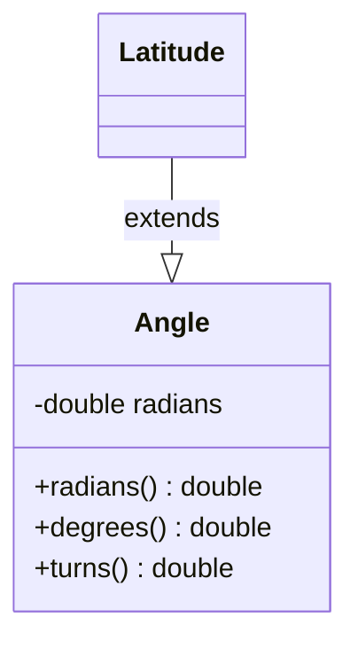

# Latitude class

## Diagram



## Summary

Language        | Type      | Symbol
:---------------| :-------- | :-------------------------------------------------
[C]             | struct    | `Latitude`
[C++]           | struct    | `dogma::Latitude`
[Dart]          | class     | `Latitude`
[Protobuf]      | message   | `dogma.Latitude`
[Python]        | class     | `dogma.Latitude`
[Ruby]          | class     | `Dogma::Latitude`
[Zig]           | struct    | `dogma.Latitude`

## Description

## Constants

### `MAX_DEGREES`

=== "C"

    ```c
    
    ```

=== "C++"

    ```c++
    
    ```

=== "Dart"

    ```dart
    
    ```

=== "Python"

    ```python
    
    ```

=== "Ruby"

    ```ruby
    
    ```

=== "Zig"

    ```zig
    
    ```

### `MIN_DEGREES`

=== "C"

    ```c
    
    ```

=== "C++"

    ```c++
    
    ```

=== "Dart"

    ```dart
    
    ```

=== "Python"

    ```python
    
    ```

=== "Ruby"

    ```ruby
    
    ```

=== "Zig"

    ```zig
    
    ```

## Constructor

=== "C"

    ```c
    Latitude(27.9881)
    ```

=== "C++"

    ```c++
    Latitude{27.9881}
    ```

=== "Dart"

    ```dart
    Latitude(27.9881)
    ```

=== "Python"

    ```python
    Latitude(27.9881)
    ```

=== "Ruby"

    ```ruby
    Latitude.new(27.9881)
    ```

=== "Zig"

    ```zig
    Latitude.init(27.9881)
    ```

## Properties

## Methods

## Schema

=== "Flat Buffers"

    ```protobuf
    struct Latitude {
      angle: Angle;
    }
    ```

=== "Joi"

    ```javascript
    Joi.number().min(-90).max(90)
    ```

=== "JSON Schema"

    ```json
    {
      "type": "number",
      "minimum": -90,
      "maximum": 90
    }
    ```

=== "OWL"

    ```turtle
    dogma:Latitude
      a owl:DatatypeProperty ;
      rdfs:range xsd:double .

    []
      a owl:Restriction ;
      owl:onProperty dogma:Latitude ;
      owl:someValuesFrom [
        a rdfs:Datatype ;
        owl:onDatatype xsd:double ;
        owl:withRestrictions (
          [xsd:minInclusive "-90"^^xsd:double]
          [xsd:maxInclusive "90"^^xsd:double]
        )
      ] .
    ```

=== "Protocol Buffers"

    ```protobuf
    message Latitude {
      Angle angle = 1;
    }
    ```

=== "SQL"

    ```sql
    latitude DOUBLE PRECISION  -- in degrees from -90° to 90°
    ```

=== "XML Schema"

    ```xml
    <xs:simpleType name="Latitude">
      <xs:restriction base="xs:double">
        <xs:minInclusive value="-90"/>
        <xs:maxInclusive value="90"/>
      </xs:restriction>
    </xs:simpleType>
    ```

## Serialization

=== "JSON"

    ```json
    27.9881  // Latitude of Mt. Everest
    ```

=== "JSON-LD"

    ```json
    // TODO
    ```

=== "XML"

    ```xml
    <!-- TODO -->
    ```

## FAQs

## References

- [en.wikipedia.org/wiki/Latitude](https://en.wikipedia.org/wiki/Latitude)

[C]:        https://github.com/dogmatists/dogma.c/blob/master/dogma/latitude.h
[C++]:      https://github.com/dogmatists/dogma.cpp/blob/master/dogma/latitude.hpp
[Dart]:     https://github.com/dogmatists/dogma.dart/blob/master/lib/src/latitude.dart
[Protobuf]: https://github.com/dogmatists/dogma.pb/blob/master/src/latitude.proto
[Python]:   https://github.com/dogmatists/dogma.py/blob/master/src/dogma/latitude.py
[Ruby]:     https://github.com/dogmatists/dogma.rb/blob/master/lib/dogma/latitude.rb
[Zig]:      https://github.com/dogmatists/dogma.zig/blob/master/src/latitude.zig
