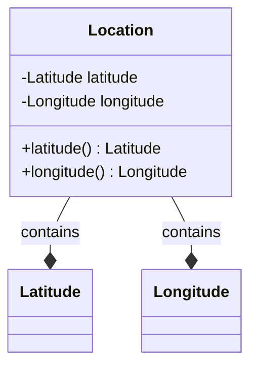

# Location class

## Diagram



## Summary

Language        | Type      | Symbol
:---------------| :-------- | :-------------------------------------------------
[C]             | struct    | `Location`
[C++]           | struct    | `dogma::Location`
[Dart]          | class     | [`Location`](https://pub.dev/documentation/dogma/latest/dogma/Location-class.html)
[Go]            | struct    | [`dogma.Location`](https://godoc.org/github.com/dogmatists/dogma.go/dogma#Location)
[Java]          | interface | `dogma.Location`
[JS]            | class     | `dogma.Location`
[Protobuf]      | message   | `dogma.Location`
[Python]        | class     | `dogma.Location`
[Ruby]          | class     | [`Dogma::Location`](https://rubydoc.info/github/dogmatists/dogma.rb/master/Dogma/Location)
[Rust]          | struct    | [`dogma::Location`](https://docs.rs/dogma/latest/dogma/struct.Location.html)
[Zig]           | struct    | `dogma.Location`

## Description

## Import

=== "C"

    ```c
    #include <dogma.h>  // for Location
    ```

=== "C++"

    ```c++
    #include <dogma.hpp>  // for Location

    using dogma::Location;
    ```

=== "Dart"

    ```dart
    import 'package:dogma/dogma.dart' show Location;
    ```

=== "Go"

    ```go
    import "github.com/dogmatists/dogma.go/dogma"
    ```

=== "Java"

    ```java
    import dogma.Location;
    ```

=== "JS"

    ```typescript
    import {Location} from "./dogma.js";
    ```

=== "Python"

    ```python
    from dogma import Location
    ```

=== "Ruby"

    ```ruby
    require 'dogma'

    include Dogma::Location
    ```

=== "Rust"

    ```rust
    extern crate dogma;

    use dogma::Location;
    ```

=== "Zig"

    ```zig
    const Location = @import("dogma").Location;
    ```

## Constants

## Constructor

=== "C"

    ```c
    Location(27.9881, 86.9250)
    ```

=== "C++"

    ```c++
    Location{27.9881, 86.9250}
    ```

=== "Dart"

    ```dart
    Location(27.9881, 86.9250)
    ```

=== "Go"

    ```go
    NewLocation(27.9881, 86.9250)
    ```

=== "Java"

    ```java
    Location.of(27.9881, 86.9250)
    ```

=== "JS"

    ```typescript
    new Location(27.9881, 86.9250)
    ```

=== "Python"

    ```python
    Location(27.9881, 86.9250)
    ```

=== "Ruby"

    ```ruby
    Location.new(27.9881, 86.9250)
    ```

=== "Rust"

    ```rust
    Location::new(27.9881, 86.9250)
    ```

=== "Zig"

    ```zig
    Location.init(27.9881, 86.9250)
    ```

## Properties

### latitude

### longitude

## Methods

## Schema

=== "Flat Buffers"

    ```protobuf
    struct Location {
      latitude: Latitude;
      longitude: Longitude;
    }
    ```

=== "Joi"

    ```javascript
    Joi.object().keys({
      latitude: Joi.number().min(-90).max(90).required(),
      longitude: Joi.number().min(-180).max(180).required(),
    })
    ```

=== "JSON Schema"

    ```json
    {
      "type": "object",
      "properties": {
        "latitude": {
          "type": "number",
          "minimum": -90,
          "maximum": 90
        },
        "longitude": {
          "type": "number",
          "minimum": -180,
          "maximum": 180
        }
      },
      "required": ["latitude", "longitude"]
    }
    ```

=== "OWL"

    ```turtle
    # TODO
    ```

=== "Protocol Buffers"

    ```protobuf
    message Location {
      Latitude latitude = 1;
      Longitude longitude = 2;
    }
    ```

=== "SQL"

    ```sql
    latitude DOUBLE PRECISION,   -- in degrees from -90° to 90°
    longitude DOUBLE PRECISION,  -- in degrees from -180° to 180°
    ```

=== "XML Schema"

    ```xml
    <xs:complexType name="Location">
      <xs:attribute name="latitude" type="Latitude" use="required"/>
      <xs:attribute name="longitude" type="Longitude" use="required"/>
    </xs:complexType>
    ```

## Serialization

=== "JSON"

    ```json
    {"latitude": 27.9881, "longitude": 86.9250}  // Mt. Everest
    ```

=== "JSON-LD"

    ```json
    // TODO
    ```

=== "XML"

    ```xml
    <location latitude="27.9881" longitude="86.9250"/>  <!-- Mt. Everest -->
    ```

## FAQs

## References

- [en.wikipedia.org/wiki/Location](https://en.wikipedia.org/wiki/Location)

[C]:        https://github.com/dogmatists/dogma.c/blob/master/dogma/location.h
[C++]:      https://github.com/dogmatists/dogma.cpp/blob/master/dogma/location.hpp
[Dart]:     https://github.com/dogmatists/dogma.dart/blob/master/lib/src/location.dart
[Go]:       https://github.com/dogmatists/dogma.go/blob/master/dogma/location.go
[Java]:     https://github.com/dogmatists/dogma.java/blob/master/src/main/java/dogma/Location.java
[JS]:       https://github.com/dogmatists/dogma.js/blob/master/src/location.ts
[Protobuf]: https://github.com/dogmatists/dogma.pb/blob/master/src/location.proto
[Python]:   https://github.com/dogmatists/dogma.py/blob/master/src/dogma/location.py
[Ruby]:     https://github.com/dogmatists/dogma.rb/blob/master/lib/dogma/location.rb
[Rust]:     https://github.com/dogmatists/dogma.rs/blob/master/src/location.rs
[Zig]:      https://github.com/dogmatists/dogma.zig/blob/master/src/location.zig
