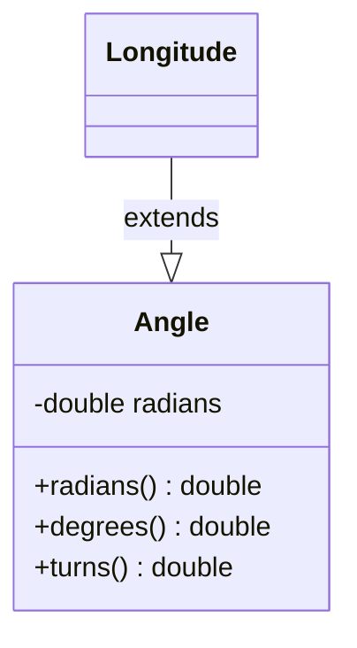

# Longitude class

## Diagram



## Summary

Language        | Type      | Symbol
:---------------| :-------- | :-------------------------------------------------
[C]             | struct    | `Longitude`
[C++]           | struct    | `dogma::Longitude`
[Dart]          | class     | [`Longitude`](https://pub.dev/documentation/dogma/latest/dogma/Longitude-class.html)
[Go]            | struct    | [`dogma.Longitude`](https://godoc.org/github.com/dogmatists/dogma.go/dogma#Longitude)
[Java]          | interface | `dogma.Longitude`
[JS]            | class     | `dogma.Longitude`
[Protobuf]      | message   | `dogma.Longitude`
[Python]        | class     | `dogma.Longitude`
[Ruby]          | class     | [`Dogma::Longitude`](https://rubydoc.info/github/dogmatists/dogma.rb/master/Dogma/Longitude)
[Rust]          | struct    | [`dogma::Longitude`](https://docs.rs/dogma/latest/dogma/struct.Longitude.html)
[Zig]           | struct    | `dogma.Longitude`

## Description

## Import

=== "C"

    ```c
    #include <dogma.h>  // for Longitude
    ```

=== "C++"

    ```c++
    #include <dogma.hpp>  // for Longitude

    using dogma::Longitude;
    ```

=== "Dart"

    ```dart
    import 'package:dogma/dogma.dart' show Longitude;
    ```

=== "Go"

    ```go
    import "github.com/dogmatists/dogma.go/dogma"
    ```

=== "Java"

    ```java
    import dogma.Longitude;
    ```

=== "JS"

    ```typescript
    import {Longitude} from "./dogma.js";
    ```

=== "Python"

    ```python
    from dogma import Longitude
    ```

=== "Ruby"

    ```ruby
    require 'dogma'

    include Dogma::Longitude
    ```

=== "Rust"

    ```rust
    extern crate dogma;

    use dogma::Longitude;
    ```

=== "Zig"

    ```zig
    const Longitude = @import("dogma").Longitude;
    ```

## Constants

### `MAX_DEGREES`

=== "C"

    ```c
    
    ```

=== "C++"

    ```c++
    
    ```

=== "Dart"

    ```dart
    
    ```

=== "Go"

    ```go
    dogma.MaxLongitudeDegrees  // 180
    ```

=== "Java"

    ```java
    Longitude.MAX_DEGREES  // 180
    ```

=== "JS"

    ```typescript
    Longitude.MAX_DEGREES  // 180
    ```

=== "Python"

    ```python
    
    ```

=== "Ruby"

    ```ruby
    
    ```

=== "Rust"

    ```rust
    // TODO
    ```

=== "Zig"

    ```zig
    
    ```

### `MIN_DEGREES`

=== "C"

    ```c
    
    ```

=== "C++"

    ```c++
    
    ```

=== "Dart"

    ```dart
    
    ```

=== "Go"

    ```go
    dogma.MinLongitudeDegrees  // -180
    ```

=== "Java"

    ```java
    Longitude.MIN_DEGREES  // -180
    ```

=== "JS"

    ```typescript
    Longitude.MIN_DEGREES  // -180
    ```

=== "Python"

    ```python
    
    ```

=== "Ruby"

    ```ruby
    
    ```

=== "Rust"

    ```rust
    // TODO
    ```

=== "Zig"

    ```zig
    
    ```

## Constructor

=== "C"

    ```c
    Longitude(86.9250)
    ```

=== "C++"

    ```c++
    Longitude{86.9250}
    ```

=== "Dart"

    ```dart
    Longitude(86.9250)
    ```

=== "Go"

    ```go
    NewLongitude(86.9250)
    ```

=== "Java"

    ```java
    Longitude.of(86.9250)
    ```

=== "JS"

    ```typescript
    new Longitude(86.9250)
    ```

=== "Python"

    ```python
    Longitude(86.9250)
    ```

=== "Ruby"

    ```ruby
    Longitude.new(86.9250)
    ```

=== "Rust"

    ```rust
    Longitude::new(86.9250)
    ```

=== "Zig"

    ```zig
    Longitude.init(86.9250)
    ```

## Properties

## Methods

## Schema

=== "Flat Buffers"

    ```protobuf
    struct Longitude {
      angle: Angle;
    }
    ```

=== "Joi"

    ```javascript
    Joi.number().min(-180).max(180)
    ```

=== "JSON Schema"

    ```json
    {
      "type": "number",
      "minimum": -180,
      "maximum": 180
    }
    ```

=== "OWL"

    ```turtle
    dogma:Longitude
      a owl:DatatypeProperty ;
      rdfs:range xsd:double .

    []
      a owl:Restriction ;
      owl:onProperty dogma:Longitude ;
      owl:someValuesFrom [
        a rdfs:Datatype ;
        owl:onDatatype xsd:double ;
        owl:withRestrictions (
          [xsd:minInclusive "-180"^^xsd:double]
          [xsd:maxInclusive "180"^^xsd:double]
        )
      ] .
    ```

=== "Protocol Buffers"

    ```protobuf
    message Longitude {
      Angle angle = 1;
    }
    ```

=== "SQL"

    ```sql
    longitude DOUBLE PRECISION  -- in degrees from -180° to 180°
    ```

=== "XML Schema"

    ```xml
    <xs:simpleType name="Longitude">
      <xs:restriction base="xs:double">
        <xs:minInclusive value="-180"/>
        <xs:maxInclusive value="180"/>
      </xs:restriction>
    </xs:simpleType>
    ```

## Serialization

=== "JSON"

    ```json
    86.9250  // Longitude of Mt. Everest
    ```

=== "JSON-LD"

    ```json
    // TODO
    ```

=== "XML"

    ```xml
    <!-- TODO -->
    ```

## FAQs

## References

- [en.wikipedia.org/wiki/Longitude](https://en.wikipedia.org/wiki/Longitude)
- [mathworld.wolfram.com/Longitude.html](https://mathworld.wolfram.com/Longitude.html)

[C]:        https://github.com/dogmatists/dogma.c/blob/master/dogma/longitude.h
[C++]:      https://github.com/dogmatists/dogma.cpp/blob/master/dogma/longitude.hpp
[Dart]:     https://github.com/dogmatists/dogma.dart/blob/master/lib/src/longitude.dart
[Go]:       https://github.com/dogmatists/dogma.go/blob/master/dogma/longitude.go
[Java]:     https://github.com/dogmatists/dogma.java/blob/master/src/main/java/dogma/Longitude.java
[JS]:       https://github.com/dogmatists/dogma.js/blob/master/src/longitude.ts
[Protobuf]: https://github.com/dogmatists/dogma.pb/blob/master/src/longitude.proto
[Python]:   https://github.com/dogmatists/dogma.py/blob/master/src/dogma/longitude.py
[Ruby]:     https://github.com/dogmatists/dogma.rb/blob/master/lib/dogma/longitude.rb
[Rust]:     https://github.com/dogmatists/dogma.rs/blob/master/src/longitude.rs
[Zig]:      https://github.com/dogmatists/dogma.zig/blob/master/src/longitude.zig
